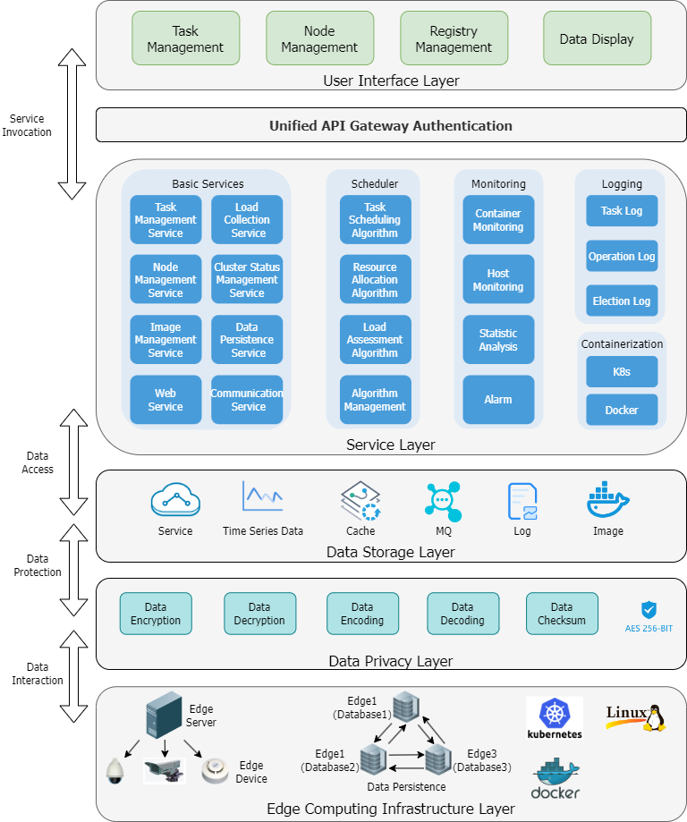
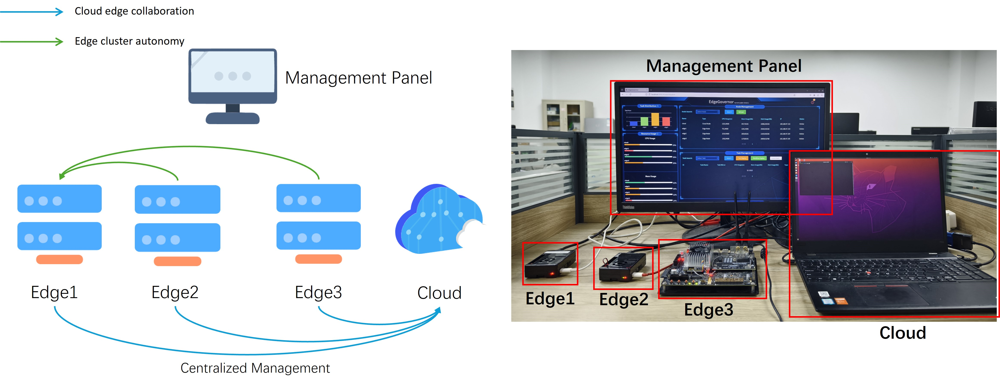
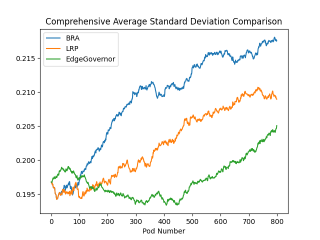
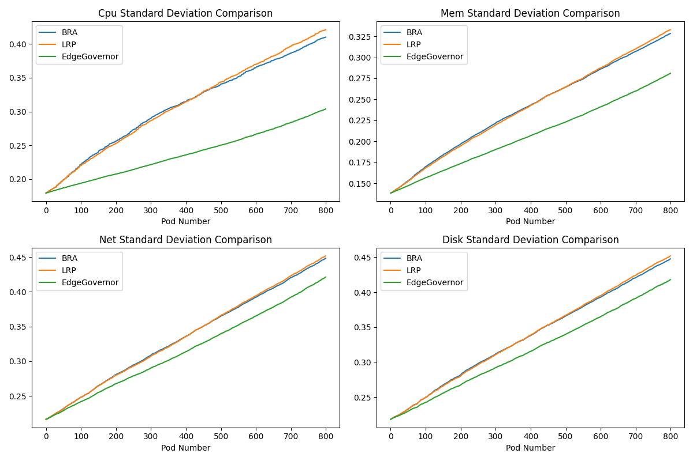
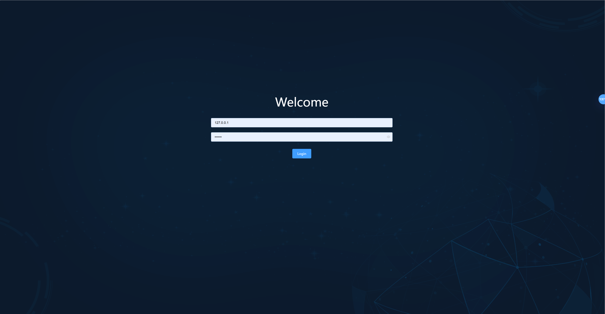
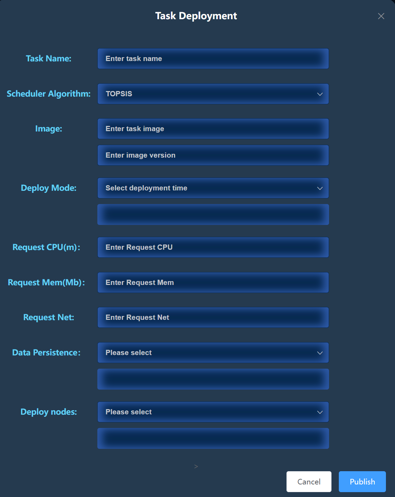
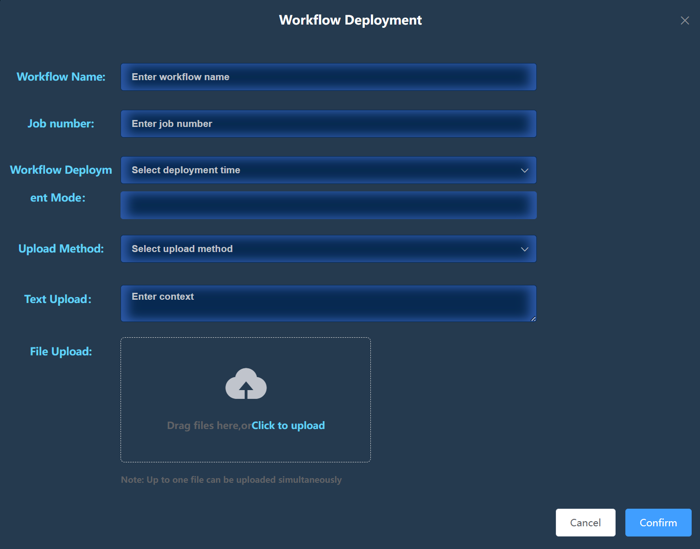
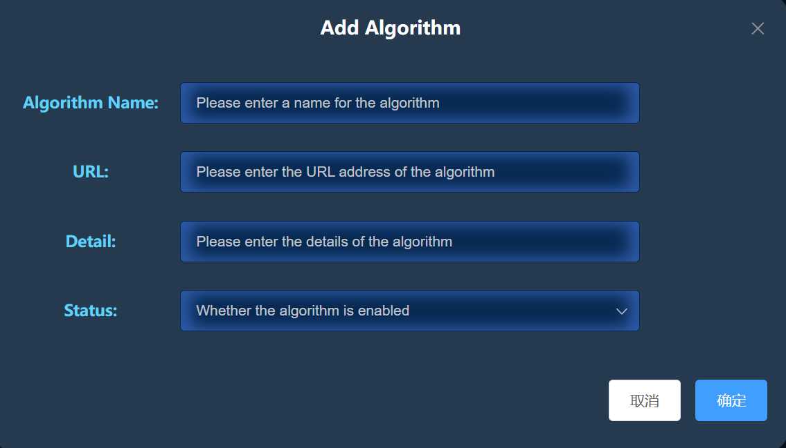

# EdgeGovernor
EdgeGovernor is an IoT framework used for cloud edge collaboration and supporting edge autonomy. Compared with traditional cloud edge collaborative systems, EdgeGovernor enhances fault tolerance and adaptability.

The demo video can be found at https://youtu.be/vXz17xd9SW0.

(1) EdgeGovernor endows IoT systems with the capability of edge cluster autonomy, ensuring cluster management even in the missing of cloud node failure. 

(2) Some built-in task scheduling and resource management algorithms are designed in a hot-swappable manner, allowing users to replace algorithms according to actual requirements. 

(3) EdgeGovernor exhibits strong compatibility and can manage numerous edge computing platforms developed based on Kubernetes. 

## Framework architecture

In the cloud-edge collaborative and edge-autonomous environments, to achieve efficient management of cluster workflows, the EdgeGovernor framework utilizes a strategy based on the leader-follower pattern and the designation of candidate node roles. The framework's architecture is composed of multiple critical layers and services, aimed at fulfilling the diverse needs of various task scenarios while ensuring the stability of the framework.

The edge computing infrastructure layer serves as the cornerstone of the EdgeGovernor architecture, jointly composed of edge servers and edge devices. EdgeGovernor is responsible for collecting various types of information from both edge servers and edge devices. These edge servers are all equipped with Docker and Kubernetes environments to support the flexible deployment of tasks in diverse scenarios. To ensure the security and reliability of data in the event of a cluster node failure, EdgeGovernor requires that the databases of all nodes form a cluster, enabling real-time data backup and ensuring the high availability of the framework.

The data privacy layer uses AES 256-CFB symmetric encryption to secure data from the host and node-to-node communication. This approach eschews common asymmetric encryption due to the centralization risks it may bring, which could undermine system security during cloud server attacks. The CFB mode's benefit is encryption without enlarging data packets, and as a stream cipher, it can detect tampering. 

The data storage layer is responsible for storing all data generated by EdgeGovernor, where key service data and task data are backed up on multiple nodes to ensure data integrity and maintain cluster state consistency in the event of node failures.

The service layer, a crucial part of EdgeGovernor, is responsible for managing cluster operations. The node management service, cluster state management service, and data persistence service work together closely to ensure that the edge cluster is still able to achieve autonomy even in the event of cloud node failures. The task management service is responsible for managing the lifecycle of all tasks within the cluster, including task creation, assignment, and monitoring. Additionally, the task management service works in conjunction with the scheduler, leveraging the scheduler's efficient resource management algorithms to further ensure the optimized allocation of cluster resources and the high efficiency of task execution.

## Framework Evaluation

To evaluate the performance of EdgeGovernor in the autonomous management of edge clusters, we constructed a full-physical simulation cluster based on a cloud-edge collaborative architecture, composed of Raspberry Pi and Nvidia TX2 devices. The cluster architecture consists of one cloud node and three edge nodes. We simulated node failure scenarios by randomly starting and stopping devices. The experimental results show that in the case of disconnection between the cloud node and the system, EdgeGovernor can still manage and control the edge cluster stably, maintain data consistency, and ensure the normal execution of tasks. For specific experimental results, please refer to the demonstration video https://youtu.be/vXz17xd9SW0.

| Device            | Role  | CPU (core) | Memory (GB) | Bandwidth (Gb/s) | Disk (GB) |
| ----------------- | ----- | ---------- | ----------- | ---------------- | --------- |
| ThinkPad P52s     | Cloud | 4          | 16          | 0.1              | 512       |
| Raspberry Pi 4B   | Edge1 | 4          | 8           | 0.1              | 64        |
| Raspberry Pi 3B   | Edge2 | 4          | 4           | 0.1              | 16        |
| Nvidia Jetson TX2 | Edge3 | 4          | 8           | 0.1              | 32        |

We use the comprehensive resource standard deviation metric of the cluster to evaluate the performance indicators of EdgeGovernor's task scheduling algorithm. The lower the value of this metric, the more uniform the distribution of resources.

Assuming a cluster is built by $n$ each of which has $m$ types of resources. The resource utilization rate of a single resource on a node is defined as $A(i,j)$, where $i$ represents different nodes and $j$ represents the resources on the node; The average value of the total utilization of all resources on a defined node is $A_{avg}$; $Z(i)$ represents the sum of standard deviations of resources on node $i$; $Z_{avg}$ is the sum of the standard deviations of the average resources in the cluster, and the smaller its value, the more uniform the distribution of resources in the cluster. Resources on nodes are not easily skewed, which can provide more resources for the cluster to deploy tasks.

$$
A_{avg}=\sum_{j=1}^{m} \frac {A(i,j)}{m}
$$

$$
Z(i)=\sqrt{\sum_{j=1}^{m}(A(i,j)-A_{avg}(i))^2}
$$

$$
Z_{avg}=\sum_{i=1}^n\frac{Z(i)}{n}
$$

The experimental results are as follows:

## Management Panel

EdgeGovernor is a Kubernetes-based IoT framework, specifically designed for cloud-edge collaboration and edge autonomous scenarios. To simplify the cluster management process, EdgeGovernor has developed a management panel for real-time monitoring and cluster management. Additionally, the cross-scenario applicability of this panel ensures data consistency and synchronization between cloud-edge collaboration and edge autonomous scenarios.

#### Panel Usage Method

1. The login interface requires entering the IP address and password of the current leader in the cluster. The IP address of the current leader can be viewed by running logs or remotely obtained by communicating with any node in the cluster using the grpcurl tool.

2. On the task publishing page, please enter relevant information about the task, select the publishing mode and task scheduling algorithm (provided that the algorithm exists), and input the requested computing resources for the task (if the value is too large, EdgeGovernor will compress the computing resources to ensure successful deployment of the task).

   

3. Workflow publishing requires users to input relevant information about the workflow, and most importantly, users need to upload workflow data for EdgeGovernor to parse. Currently, EdgeGovernor supports parsing XML data formats for well-known workflows such as Montage, Epigenomics, CyberShake, etc. However, users need to create a Job image in the workflow in advance and add an Image field to the XML data Examples of XML files can be viewed in `./workflow.xml`

   

4. EdgeGovernor supports hot swapping of algorithms. Considering that user developed algorithms have different development languages and runtime environments, EdgeGovernor adopts a remote request method. In the page, users need to specify the URL and category of the algorithm. After successful addition, the algorithm can be used on the task publishing page.

   In addition, the remote request data for EdgeGovernor is `['hostname',ip,cpu_percent, cpu_capacity, remaining_cpu_capacity, mem_percent, mem_capacity, remaining_mem_capacity, disk_percent, disk_capacity, remaining_disk_capacity, downlink_network_speed, uplink_network_speed, network_card_bandwidth]`, users can retrieve and use them as needed.

   

#### Panel Run

1. The panel is developed using Vue and JavaScript. Please install the relevant environment. It is recommended to use Vue 2.5.16 ,Nodejs 18.20.3.

2. Run `cd ./Panel/sourceSystem  && npm run dev`

3. URL `localhost:8080`

## Run EdgeGovernor

#### 1.Prerequisite

1) Linux System, Ubuntu, CentOS, etc.
2) At least 3 nodes in the cluster
3) Docker 19.0+
4) Set up a High Availability etcd Cluster 
5) Kubernetes 1.22.10, Request to mount an external ETCD high availability cluster
6) KubeEdge 1.12.1

####  2.Deployment

1) Modify node data in StorageNodeMsg() of `./EdgeGovernor/pkg/utils/node.go` file

2) Modify AES password in `./EdgeGovernor/cmd/main.go`
3) (optional) Add or replace initial algorithm in `./EdgeGovernor/cmd/main.go`
4) Modify and confirm the running parameters of EdgeGovernor and the configuration file of the ETCD database cluster in `./EdgeGovernor/pkg/constants`
5) Compile `go build ./EdgeGovernor/cmd/main.go`
6) ./main

If you encounter any issues, please raise an issue in this repository.
